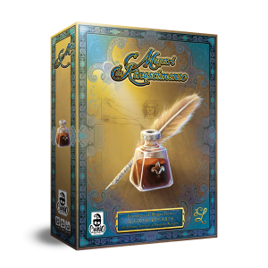
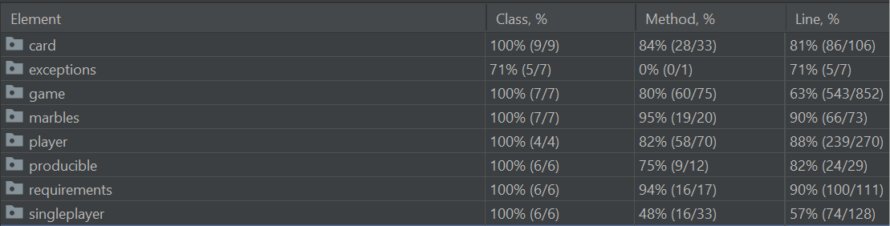

# Masters of the Renaissance Board Game porting

The goal of the project is to create a digital version of the board game [Masters of the Renaissance](https://www.craniocreations.it/prodotto/masters-of-renaissance/) as a distributed system consisting of a single server capable of managing one game and multiple clients using the MVC pattern.
<p align="center">

<figcaption>In Masters of Renaissance, you are an important citizen of Florence and your goal is to increase your fame and prestige. Take resources from the market. Expand your power both in the city and in the surrounding territories! Every card gives you a production power. Try to use the leaders’ abilities to your advantage and don’t forget to show your devotion to the Pope! </figcaption>
</p>

## Documentation :books:
### Requirements :white_check_mark:
The following requirements were covered in the development of the project:
- [x] **Complete Rules**
- [x] **CLI** and **GUI**
- [x] **Communication Protocol** (Socket)
- [x] **Advanced Features: Local Game**
- [x] **Advanced Features: Resilience to Disconnections**

### UML :bar_chart:
The class diagrams of the model are shown below. The initial UML was done in the design phase, while the final UML was generated by intelliJ. There are no substantial differences between the 2 graphs. There is also a graph that shows inheritance between classes more clearly.
- [Initial UML](https://github.com/Giuseppe-Calcagno/ingswAM2021-Caironi-Calcagno-Chiurco/blob/main/documentation/uml/initialChart.svg)
- [Final UML](https://github.com/Giuseppe-Calcagno/ingswAM2021-Caironi-Calcagno-Chiurco/blob/main/documentation/uml/finalChart.svg)
- [Hierarchy Chart](https://github.com/Giuseppe-Calcagno/ingswAM2021-Caironi-Calcagno-Chiurco/blob/main/documentation/uml/HierarchyChart.svg)

### Tool :wrench:
Here is the list of tools used to carry out this project:
|Tool|Description|
|---------------|-----------|
|__IntelliJ__|IDE|
|__Draw.io__|drawing tool|
|__Maven__|Build automation tool used primarily for Java projects.|
|__JavaFx__|Graphic library for creating user interfaces.|
|__JUnit__|Unit testing framework.|

### JavaDoc and Comunication Protocol :memo:
All the documentation regarding the java classes with their methods is available [here](https://github.com/Giuseppe-Calcagno/ingswAM2021-Caironi-Calcagno-Chiurco/tree/main/documentation/JavaDoc/it/polimi/ingsw/)

All the documentation regarding the comunication protocol is available [here](https://github.com/Giuseppe-Calcagno/ingswAM2021-Caironi-Calcagno-Chiurco/blob/main/documentation/Communication%20Protocol.pdf)

### Coverage report :microscope:
From the results of Junit we have a line covered **96% on the model**, results that we believe are satisfactory.The **controller** has not been tested as it is a very narrow part of the code that does not perform complex actions. All the analyzes on the model classes are also shown below
<p align="center">

</p>

### Starting the Game :flower_playing_cards:
The game can be started from the following [Jar files](https://github.com/Giuseppe-Calcagno/ingswAM2021-Caironi-Calcagno-Chiurco/tree/main/documentation/jar). The project was compiled using **java 15**, however there should be no problems recompiling it with a not too dated Java version.

#### Server
The server can be started via the command line, where you can optionally choose a custom listening port via the `--port` parameter
```shell
> java -jar AM16-server.jar [--port xxxx]
```
#### Client
ASCII ART was used in the implementation of the CLI, so we recommend the use of **terminal that supports UTF-8 encoding and ANSI escapes**. The client can be started via the command line by specifying 2 mandatory parameters:
- `--cli\gui`:          to select the display mode
- `--online\offline`:  to select the game mode

if the parameters are not specified correctly, the mode is selected by default: __CLI ONLINE__
```shell
> java -jar AM16-client.jar --cli\gui --online\offline
```
Note: We have included a "cheat" command that provides 100 units of each resource to show the advanced game stages
## The Dream Team :star2:
- [Giovanni Chiurco](https://github.com/GiovanniChiurco)
- [Nicolò Caironi](https://github.com/NicoloCaironi)
- [Giuseppe Calcagno](https://github.com/Giuseppe-Calcagno)

Having reached the conclusion, there is only one thing left to do: *"it's coffee break gentlemen"*


## License
Project carried out in collaboration with Politecnico di Milano and Cranio Games which granted us the license to use the graphic material.

